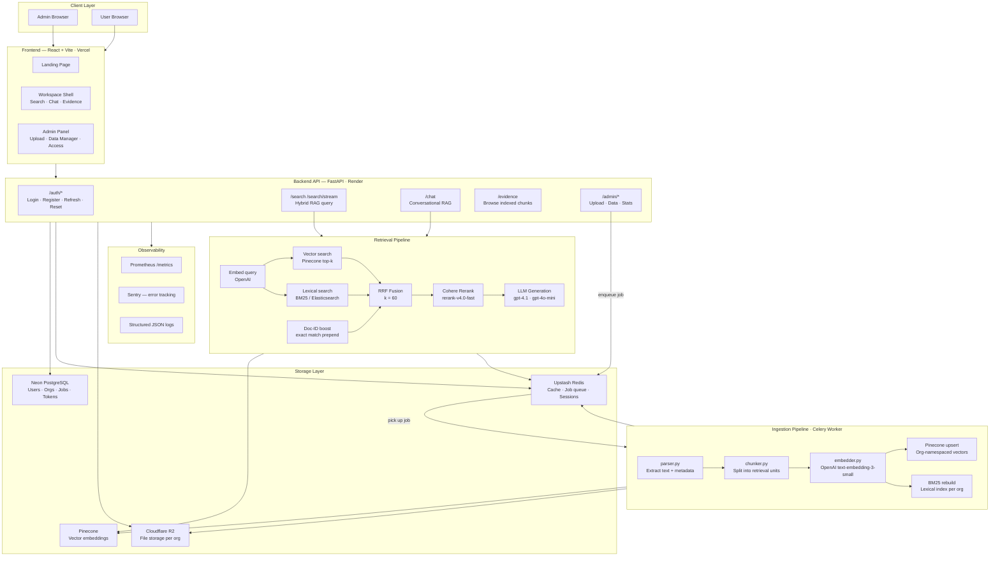

<div align="center">

# EDMS — Enterprise Document Memory System

**Search your company's internal knowledge with AI-grounded answers and linked evidence.**

Upload ADRs, RFCs, meeting notes, postmortems, tickets, and diagrams. Ask questions. Get answers sourced back to the exact document.

[](https://edms-rag.vercel.app)
[](#)
[](#)
[](#)
[](#)
[](#)
[](#license)

<br/>


</div>

---

## Table of Contents

- [What is EDMS?](#what-is-edms)
- [Features](#features)
- [System Architecture](#system-architecture)
- [Retrieval Pipeline](#retrieval-pipeline)
- [Tech Stack](#tech-stack)
- [Project Structure](#project-structure)
- [Getting Started](#getting-started)
- [Deployment](#deployment)
- [Environment Variables](#environment-variables)
- [API Reference](#api-reference)
- [Monitoring & Observability](#monitoring--observability)
- [License](#license)

---

## What is EDMS?

EDMS is a **multi-tenant RAG (Retrieval-Augmented Generation) platform** built for engineering and ops teams. Each company gets an isolated workspace. Admins upload internal documents, and every user in that workspace can search, chat, and browse evidence — all answers grounded in your actual records.

> Think of it as Notion Search meets a private ChatGPT, but every answer cites its source.

**Key ideas:**
- **Multi-tenant by design** — each org's vectors, files, and indices are fully isolated
- **Hybrid retrieval** — vector search + BM25 fused with RRF, then Cohere reranked
- **Model routing** — simple queries hit `gpt-4o-mini`; complex ones escalate to `gpt-4.1`
- **Role-based access** — admins manage data; users search and chat

---

## Features

### For Users
| Feature | Description |
|---|---|
| 🔍 **Semantic Search** | Ask questions in natural language, get grounded answers with source citations |
| 💬 **Persistent Chat** | Conversational AI with full message history, context-aware follow-ups |
| 📚 **Evidence Browser** | Browse, filter, and search all indexed chunks by document type |
| ⌨️ **Keyboard Shortcut** | Press `/` anywhere on the dashboard to focus the search box |

### For Admins
| Feature | Description |
|---|---|
| 📤 **Document Upload** | Upload ADRs, RFCs, meeting notes, postmortems, tickets, and images |
| 🔄 **Auto-Indexing** | Upload triggers extraction → chunking → embedding → index rebuild automatically |
| 🗂️ **Data Manager** | View, manage, and delete indexed files per document type |
| 🔑 **Invite Codes** | Generate and rotate invite codes to control workspace membership |
| 📊 **Index Stats** | Real-time document counts and index status per category |

### Platform
| Feature | Description |
|---|---|
| 🏢 **Multi-tenancy** | Fully isolated workspaces — vectors, files, and indices scoped per org |
| 🔐 **JWT + RBAC** | Access tokens + refresh tokens with admin/user role separation |
| ⚡ **Streaming Answers** | Server-Sent Events stream the LLM response token by token |
| 🖼️ **Image Support** | Upload diagrams/screenshots — processed through multimodal pipeline |
| 🚦 **Rate Limiting** | Per-endpoint limits (search 60/min, chat 90/min, upload 12/min) |
| 🧠 **Multi-layer Cache** | Disk cache for embeddings (24h), memory cache for answers (3min) |

---

## System Architecture



---

## Retrieval Pipeline

EDMS uses a **5-stage hybrid retrieval** pipeline instead of naive vector search:

```
Query
  │
  ├─① Embed query (OpenAI text-embedding-3-small, disk-cached 24h)
  │
  ├─② Build candidate pool
  │     ├── Semantic  — Pinecone ANN top-k per org namespace
  │     ├── Lexical   — BM25 / Elasticsearch keyword match
  │     └── Exact     — doc-ID match boost (prepended regardless of score)
  │
  ├─③ Fuse with RRF (Reciprocal Rank Fusion, k=60)
  │     Combines semantic + lexical rankings without score normalisation
  │
  ├─④ Rerank (Cohere rerank-v4.0-fast)
  │     Falls back to heuristic scorer if Cohere is unavailable:
  │     0.30·semantic + 0.22·lexical + 0.18·token-overlap
  │     + 0.18·metadata + 0.12·fusion
  │
  └─⑤ Generate (model-routed)
        gpt-4o-mini  — short query, few evidence chunks, short history
        gpt-4.1      — query >16 words, history >6 turns, evidence >2400 chars
        Streams via SSE · answer cached 3 min in memory
```

---

## Tech Stack

### Backend
| Layer | Technology | Notes |
|---|---|---|
| API framework | **FastAPI** 0.115 + Python 3.12 | Async, typed, OpenAPI auto-docs |
| Auth | **JWT** (python-jose) + bcrypt | Access + refresh tokens, RBAC |
| Vector DB | **Pinecone** | Org-namespaced indices |
| Lexical search | **BM25** (rank-bm25) / **Elasticsearch** | Local fallback → ES in prod |
| LLM | **OpenAI** GPT-4.1 + GPT-4o-mini | Model-routed by complexity |
| Embeddings | **OpenAI** text-embedding-3-small | Disk-cached 30 days |
| Reranker | **Cohere** rerank-v4.0-fast | Heuristic fallback |
| Task queue | **Celery** + **Redis** | Thread pool in dev |
| Database | **PostgreSQL** (Neon) | Users, orgs, jobs, tokens |
| File storage | **S3-compatible** (Cloudflare R2) | Per-org path isolation |
| Cache | **Redis** (Upstash) | Multi-layer: disk + memory + Redis |
| Rate limiting | **slowapi** | Per-endpoint, per-IP |

### Frontend
| Layer | Technology | Notes |
|---|---|---|
| Framework | **React 19** + **Vite 6** | SPA, fast HMR |
| Styling | **Tailwind CSS v4** | Design tokens, CSS variables |
| Routing | **React Router v7** | Client-side SPA routing |
| Streaming | **SSE / fetch stream** | Token-by-token chat rendering |
| State | useState + Context | Toast system, auth payload |

### Infrastructure
| Service | Provider | Purpose |
|---|---|---|
| Frontend hosting | **Vercel** | CDN + edge, instant deploys |
| API hosting | **Render** | Docker web service |
| Background worker | **Render** | Celery ingestion worker |
| Database | **Neon** | Serverless Postgres |
| Cache + queue | **Upstash** | Serverless Redis |
| Vector store | **Pinecone** | Managed vector DB |
| Object storage | **Cloudflare R2** | S3-compatible file store |
| Error tracking | **Sentry** | Frontend + backend |
| CI/CD | **GitHub Actions** | Lint, build, Docker |

---

## Project Structure

```
edms-rag/
├── docs/
│   └── demo.gif                    # Product demo GIF
├── edms/                           # FastAPI backend
│   ├── Dockerfile
│   ├── requirements.txt
│   ├── .env.example
│   └── src/
│       ├── api/
│       │   ├── main.py             # App entry, middleware, startup
│       │   ├── auth_routes.py      # /auth/* endpoints
│       │   ├── chat_routes.py      # /chat endpoint (SSE streaming)
│       │   ├── evidence_routes.py  # /evidence browsing
│       │   ├── index_manager.py    # Admin upload + reindex
│       │   ├── state_routes.py     # /admin/data CRUD
│       │   └── stats_routes.py     # /stats
│       ├── auth/
│       │   ├── models.py           # User, Org Pydantic models
│       │   ├── jwt_handler.py      # Token issue + verify
│       │   └── dependencies.py     # get_current_user, require_admin
│       ├── ingestion/
│       │   ├── job_store.py        # SQLite job queue
│       │   ├── worker.py           # Celery tasks
│       │   └── image_processor.py  # Multimodal image handling
│       ├── retrieval/
│       │   ├── bm25_index.py       # BM25 index per org
│       │   └── text_utils.py       # Tokenisation helpers
│       ├── chunker.py              # Text splitting strategy
│       ├── embedder.py             # OpenAI embedding wrapper + cache
│       ├── generator.py            # Model routing + LLM call
│       ├── parser.py               # Document text + metadata extraction
│       ├── retriever.py            # Full 5-stage pipeline
│       ├── vector_store.py         # FAISS local backend
│       ├── pinecone_store.py       # Pinecone backend
│       ├── db.py                   # Postgres connection + helpers
│       ├── state_store.py          # Token tables, org state
│       ├── tenancy.py              # Org isolation helpers
│       ├── cache_store.py          # Memory + disk cache
│       ├── runtime_config.py       # Env-based feature flags
│       └── telemetry.py            # Structured logging + OTel
├── edms-frontend/                  # React + Vite frontend
│   ├── index.html                  # SEO meta, OG tags, JSON-LD
│   ├── vite.config.js
│   ├── public/
│   │   └── robots.txt
│   └── src/
│       ├── api/                    # HTTP client wrappers per domain
│       │   ├── config.js           # Base fetch + session expiry
│       │   ├── auth.js
│       │   ├── admin.js
│       │   ├── search.js
│       │   ├── chat.js
│       │   └── stats.js
│       ├── components/
│       │   ├── WorkspaceShell.jsx  # Layout wrapper (sidebar + main)
│       │   ├── Sidebar.jsx         # Role-aware navigation
│       │   ├── DashboardHeader.jsx
│       │   ├── EvidenceItem.jsx    # Chunk card with highlight
│       │   ├── FormattedContent.jsx# Markdown renderer
│       │   ├── Toast.jsx           # Toast context + hook
│       │   ├── ErrorBoundary.jsx   # React error boundary
│       │   └── AppIcons.jsx        # SVG icon library
│       ├── hooks/
│       │   ├── usePageTitle.js     # Per-page document.title
│       │   └── useRecentSearches.js
│       ├── pages/
│       │   ├── Login.jsx           # Landing + auth modals
│       │   ├── Dashboard.jsx       # Search + results
│       │   ├── Chat.jsx            # Conversational RAG
│       │   ├── EvidenceBrowser.jsx # Browse + filter chunks
│       │   ├── AdminUpload.jsx     # File upload with job polling
│       │   ├── AdminDataManager.jsx# Delete / manage org files
│       │   ├── AdminAccess.jsx     # Invite code management
│       │   └── NotFound.jsx        # 404 fallback
│       └── utils/
│           └── auth.js             # JWT payload decode
├── sample_data/                    # Example documents for testing
│   ├── adrs/
│   ├── rfcs/
│   ├── meeting_notes/
│   ├── postmortems/
│   ├── tickets/
│   └── images/
├── docker-compose.yml
├── CLAUDE.md                       # AI assistant project reference
└── .github/
    └── workflows/
        └── ci.yml
```

---

## Getting Started

### Prerequisites

- Python 3.12+
- Node.js 20+
- OpenAI API key (required)
- Pinecone API key (required for vector search)
- Cohere API key (optional — heuristic fallback used if absent)

### 1. Clone

```bash
git clone https://github.com/adityasnehai/edms-rag.git
cd edms-rag
```

### 2. Backend

```bash
cd edms
python3 -m venv .venv
source .venv/bin/activate
pip install -r requirements.txt
cp .env.example .env
# Fill in OPENAI_API_KEY, PINECONE_API_KEY, JWT_SECRET at minimum
uvicorn src.api.main:app --host 127.0.0.1 --port 8001 --reload
```

### 3. Frontend

```bash
cd edms-frontend
npm install
cp .env.example .env
# Set VITE_API_BASE_URL=http://127.0.0.1:8001
npm run dev
```

### 4. Open

| Service | URL |
|---|---|
| Frontend | http://localhost:5173 |
| Backend API | http://localhost:8001 |
| API docs | http://localhost:8001/docs |

### 5. First run

1. The backend seeds the first admin user from `ADMIN_EMAIL` / `ADMIN_PASSWORD` / `ADMIN_ORG_NAME` env vars on startup.
2. Sign in as admin → upload sample files from `sample_data/` → start searching.

### Docker (full stack)

```bash
cp edms/.env.example edms/.env   # fill required vars
docker compose up --build
```

---

## Deployment

### Cloud Services Map

| Component | Recommended Service | Alternative |
|---|---|---|
| Frontend | **Vercel** | Cloudflare Pages |
| Backend API | **Render** (Docker) | Railway, Fly.io |
| Celery worker | **Render** (Background Worker) | Railway worker |
| PostgreSQL | **Neon** | Supabase, Railway |
| Redis | **Upstash** | Railway Redis |
| Vector store | **Pinecone** | Qdrant Cloud |
| File storage | **Cloudflare R2** | AWS S3 |
| Error tracking | **Sentry** | GlitchTip |

### Step-by-Step Deployment

```
1.  Push code to GitHub (main branch)
2.  Create Neon Postgres → copy DATABASE_URL
3.  Create Upstash Redis → copy REDIS_URL, CELERY_BROKER_URL, CELERY_RESULT_BACKEND
4.  Create Pinecone index (dimension: 1536, metric: cosine) → copy PINECONE_API_KEY
5.  Create Cloudflare R2 bucket → copy R2_* credentials
6.  Deploy backend on Render (Docker, root: edms/) → set all env vars
7.  Deploy Celery worker on Render (same image, command: celery -A src.worker worker)
8.  Set CORS_ALLOW_ORIGINS to your Vercel URL on the backend
9.  Deploy frontend on Vercel → set VITE_API_BASE_URL to Render backend URL
10. Attach Sentry DSN to frontend (VITE_SENTRY_DSN) and backend (GLITCHTIP_DSN)
11. Run smoke test: sign up → upload a file → search → confirm answer is grounded
```

---

## Environment Variables

### Backend (`edms/.env`)

| Variable | Required | Description |
|---|---|---|
| `APP_ENV` | Yes | `development` or `production` |
| `JWT_SECRET` | Yes | Long random string for signing tokens |
| `OPENAI_API_KEY` | Yes | Embeddings + generation |
| `PINECONE_API_KEY` | Yes | Vector store |
| `COHERE_API_KEY` | No | Reranker (heuristic fallback if absent) |
| `DATABASE_URL` | Yes (prod) | Neon Postgres connection string |
| `REDIS_URL` | Yes (prod) | Upstash Redis URL |
| `CELERY_BROKER_URL` | Yes (prod) | Redis URL for Celery |
| `CELERY_RESULT_BACKEND` | Yes (prod) | Redis URL for Celery results |
| `ELASTICSEARCH_URL` | No | Enables ES lexical backend |
| `OBJECT_STORAGE_BACKEND` | No | `s3` or `local` (default) |
| `S3_BUCKET` | Prod | R2 / S3 bucket name |
| `R2_ENDPOINT_URL` | Prod | Cloudflare R2 endpoint |
| `R2_ACCESS_KEY_ID` | Prod | R2 access key |
| `R2_SECRET_ACCESS_KEY` | Prod | R2 secret key |
| `CORS_ALLOW_ORIGINS` | Prod | Comma-separated allowed origins |
| `ADMIN_EMAIL` | Yes | Seeds first admin user on startup |
| `ADMIN_PASSWORD` | Yes | Seeds first admin password |
| `ADMIN_ORG_NAME` | Yes | Seeds first org name |
| `GLITCHTIP_DSN` | No | Sentry-compatible error tracking |

See [`edms/.env.example`](edms/.env.example) for the full template.

### Frontend (`edms-frontend/.env`)

| Variable | Required | Description |
|---|---|---|
| `VITE_API_BASE_URL` | Yes | Backend URL (e.g. `https://your-api.onrender.com`) |
| `VITE_SENTRY_DSN` | No | Frontend error tracking |

---

## API Reference

| Method | Endpoint | Auth | Description |
|---|---|---|---|
| `POST` | `/auth/login` | — | Login, returns JWT pair |
| `POST` | `/auth/register` | — | Create org + admin user |
| `POST` | `/auth/register-user` | — | Join org via invite code |
| `POST` | `/auth/refresh` | Refresh token | Issue new access token |
| `POST` | `/auth/logout` | JWT | Revoke refresh token |
| `GET` | `/search?q=&top_k=` | JWT | Hybrid RAG search |
| `POST` | `/search/stream` | JWT | Streaming search (SSE) |
| `POST` | `/chat` | JWT | Conversational RAG with history |
| `GET` | `/evidence` | JWT | Browse indexed chunks |
| `GET` | `/stats` | JWT | Index stats + document counts |
| `POST` | `/admin/upload` | Admin JWT | Upload + ingest files |
| `GET` | `/admin/data` | Admin JWT | List org files |
| `DELETE` | `/admin/data` | Admin JWT | Delete org files |
| `GET` | `/admin/org` | Admin JWT | Org details + invite code |
| `POST` | `/admin/org/rotate-invite` | Admin JWT | Rotate invite code |
| `GET` | `/ready` | — | Readiness probe |
| `GET` | `/live` | — | Liveness probe |
| `GET` | `/metrics` | Internal | Prometheus metrics |

Full interactive docs available at `/docs` when running locally.

---

## Monitoring & Observability

| Signal | Tool | Endpoint / Location |
|---|---|---|
| Metrics | **Prometheus** | `GET /metrics` |
| Traces | **OpenTelemetry** | OTLP export (configurable) |
| Errors | **Sentry / GlitchTip** | `GLITCHTIP_DSN` env var |
| Logs | **Structured JSON** | stdout → Render log drain |
| Uptime | **Uptime Kuma** | `/live` + `/ready` probes |

Key metrics exposed:
- `edms_retrieval_total` — retrieval calls by org and backend
- `edms_llm_requests_total` — generation calls by model
- `edms_job_queue_depth` — pending ingestion jobs
- `http_requests_total` — request counts by route and status

---

## License

MIT — see [LICENSE](LICENSE) for details.

---

<div align="center">

Built with FastAPI · React · Pinecone · OpenAI · Cohere

[Live Demo](https://edms-rag.vercel.app) · [Report a Bug](https://github.com/adityasnehai/edms-rag/issues) · [Request a Feature](https://github.com/adityasnehai/edms-rag/issues)

</div>
