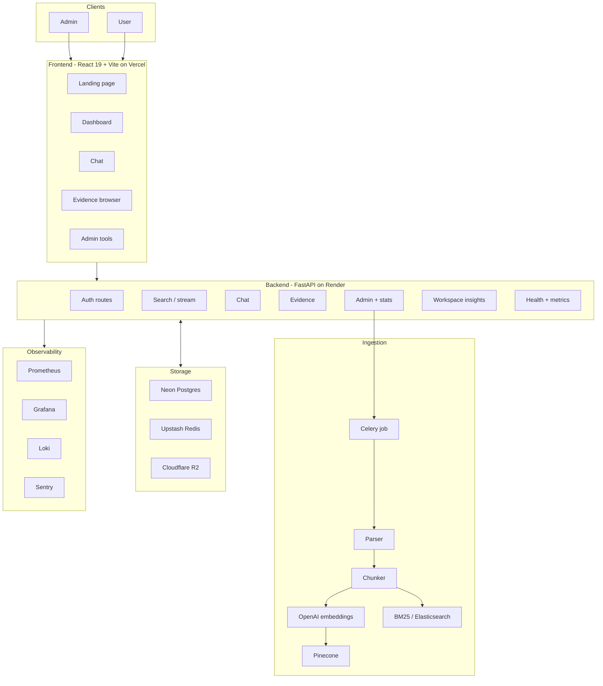

<div align="center">

# MemoStack (EDMS) — Incident and Decision Memory

**Turn engineering docs, incidents, and decisions into grounded answers with linked evidence.**

MemoStack (EDMS) is built for teams that need the decision trail, not another generic chatbot. Upload ADRs, RFCs, meeting notes, postmortems, tickets, and diagrams. Ask questions in plain English. Get answers tied back to the exact source.

[](https://edms-rag.vercel.app)
[](#)
[](#)
[](#)
[](#)
[](#)
[](#)
[](#license)

<br/>


</div>

---

## Table of Contents

- [What is MemoStack (EDMS)?](#what-is-memostack-edms)
- [Features](#features)
- [System Architecture](#system-architecture)
- [Retrieval Pipeline](#retrieval-pipeline)
- [Evaluation](#evaluation)
- [Tech Stack](#tech-stack)
- [Workflow Preview](#workflow-preview)
- [Project Structure](#project-structure)
- [Getting Started](#getting-started)
- [Deployment](#deployment)
- [Environment Variables](#environment-variables)
- [API Reference](#api-reference)
- [Monitoring & Observability](#monitoring--observability)
- [License](#license)

---

## What is MemoStack (EDMS)?

MemoStack (EDMS) is a **multi-tenant RAG platform for engineering and ops teams**. Each company gets an isolated workspace. Admins upload internal documents, incident notes, and diagrams. Users search, chat, and browse evidence with every answer grounded in source material.

> Think of it as incident memory for engineering teams, but every answer cites its source.

**Key ideas:**
- **Multi-tenant by design** - each org's files, vectors, cache, and indices stay isolated
- **Hybrid retrieval** - Pinecone + BM25 + reranking to avoid single-signal misses
- **Model routing** - simple queries use `gpt-4o-mini`; harder ones escalate to `gpt-4.1`
- **Role-based access** - admins manage data; users search, chat, and inspect evidence

---

## Features

### For Users
| Feature | Description |
|---|---|
| 🔍 **Search** | Natural language search with grounded answers and evidence cards |
| 💬 **Chat** | Conversation history with follow-up questions tied to workspace context |
| 📚 **Evidence** | Browse indexed chunks by type, source, and match quality |
| ⌨️ **Shortcut** | Press `/` anywhere on the dashboard to focus search instantly |

### For Admins
| Feature | Description |
|---|---|
| 📤 **Document Upload** | Upload ADRs, RFCs, notes, postmortems, tickets, and images |
| 🔄 **Auto-Indexing** | Upload triggers extraction, chunking, embedding, and index refresh |
| 🗂️ **Data Manager** | View, replace, and delete indexed files per document type |
| 🔑 **Invite Codes** | Generate and rotate invite codes for workspace access |
| 📊 **Index Stats** | Workspace counts, ingestion status, and source coverage |

### Platform
| Feature | Description |
|---|---|
| 🏢 **Multi-tenancy** | Workspaces are isolated by org for files, vectors, cache, and jobs |
| 🔐 **JWT + RBAC** | Access and refresh tokens with admin/user separation |
| ⚡ **Streaming Answers** | SSE streams responses token by token |
| 🖼️ **Image Support** | Diagrams and screenshots flow through the multimodal pipeline |
| 🚦 **Rate Limiting** | Per-endpoint limits for search, chat, upload, and auth |
| 🧠 **Caching** | Disk cache for embeddings and in-memory answer caching |

---

## System Architecture



---

## Retrieval Pipeline

EDMS uses a **6-stage hybrid retrieval pipeline**:

```
Query
  │
  ├─① Embed query
  │     OpenAI text-embedding-3-small · 1536 dims
  │     Result disk-cached 24h (keyed by query + org)
  │
  ├─② Build candidate pool  (3 sources merged)
  │     ├── Semantic   — Pinecone ANN top-k in org namespace
  │     ├── Lexical    — BM25 keyword match, rebuilt per upload
  │     └── Exact      — doc-ID boost for direct references
  │
  ├─③ RRF Fusion  (Reciprocal Rank Fusion, k=60)
  │     Combines semantic and lexical ranks without score normalisation
  │     Candidate pool = final_top_k × HYBRID_CANDIDATE_MULTIPLIER
  │
  ├─④ Heuristic Reranker  (5-signal weighted scorer)
  │     Each signal is min-max normalised before weighting:
  │       0.30 × semantic cosine similarity
  │       0.22 × BM25 lexical score
  │       0.18 × token overlap
  │       0.18 × metadata match
  │       0.12 × RRF fusion score
  │     Ties broken by fusion score and sliced to top_k
  │
  ├─⑤ Model routing  (automatic, no config needed)
  │     → gpt-4o-mini  if: query ≤16 words AND history ≤6 turns
  │                        AND evidence ≤2400 chars AND chunks ≥2
  │     → gpt-4.1      if: any of the above thresholds exceeded
  │
  └─⑥ Generate answer
        Streaming (SSE) and sync modes
        Answer cached 3 min in memory per org
        Grounded fallback answer if LLM call fails
```

## Evaluation

EDMS includes a synthetic evaluation suite in [`edms/eval/`](edms/eval/) to check retrieval quality, grounding, and abstention behavior on workspace-style documents.

### What we evaluated

| Step | What it checks |
|---|---|
| Synthetic corpus build | 50 source documents across ADRs, RFCs, meeting notes, postmortems, and tickets |
| Query generation | 210 examples covering answerable and unanswerable questions |
| Retrieval eval | Recall@1/3/5, MRR, answer support, and no-answer accuracy |
| LLM judge pass | Groundedness, answer quality, citation quality, abstention quality, and overall score |

### Dataset shape

| Item | Count | Notes |
|---|---:|---|
| Documents | 50 | Workspace corpus used to build chunks |
| Chunks | 230 | Indexed retrieval units |
| Total examples | 210 | Synthetic benchmark examples |
| Positive examples | 200 | Answerable questions |
| Negative examples | 10 | Out-of-scope / no-answer questions |
| ADRs | 40 | 4 queries per doc family |
| RFCs | 40 | 4 queries per doc family |
| Meeting notes | 40 | 4 queries per doc family |
| Postmortems | 40 | 4 queries per doc family |
| Tickets | 40 | 4 queries per doc family |
| Mixed negatives | 10 | No-answer validation set |

### Results

| Scope | Metric | Value |
|---|---|---:|
| Overall | Retrieval recall@1 | 0.80 |
| Overall | Retrieval recall@3 | 0.80 |
| Overall | Retrieval recall@5 | 0.85 |
| Overall | MRR | 0.9559 |
| Overall | Answer support@1 | 0.80 |
| Overall | Answer support@3 | 0.80 |
| Overall | No-answer accuracy | 1.00 |
| ADRs | Recall@1 / @3 / @5 | 0.50 / 0.50 / 0.75 |
| ADRs | MRR | 0.5625 |
| Meeting notes | Recall@1 / @3 / @5 | 0.75 / 0.75 / 0.75 |
| Meeting notes | MRR | 0.75 |
| Postmortems | Recall@1 / @3 / @5 | 1.00 / 1.00 / 1.00 |
| Postmortems | MRR | 1.00 |
| RFCs | Recall@1 / @3 / @5 | 0.75 / 0.75 / 0.75 |
| RFCs | MRR | 0.75 |
| Tickets | Recall@1 / @3 / @5 | 1.00 / 1.00 / 1.00 |
| Tickets | MRR | 1.00 |
| Negative set | Recall@1 / @3 / @5 | 0.00 / 0.00 / 0.00 |
| Negative set | MRR | 0.00 |

### LLM judge pass

| Item | Value |
|---|---:|
| Judge model | `gpt-4o-mini` |
| Examples scored | 24 |
| Mean groundedness | 3.5 / 5 |
| Mean answer quality | 3.0 / 5 |
| Mean citation quality | 3.5 / 5 |
| Mean abstention quality | 1.1667 / 5 |
| Mean overall | 3.0 / 5 |

### Eval artifacts

| File | Purpose |
|---|---|
| `edms/eval/synthetic_dataset.jsonl` | Synthetic benchmark input |
| `edms/eval/synthetic_dataset.csv` | Tabular benchmark export |
| `edms/eval/eval_results.json` | Retrieval evaluation output |
| `edms/eval/eval_summary.csv` | Human-readable summary table |
| `edms/eval/eval_examples.csv` | Example-by-example results |
| `edms/eval/eval_validation.json` | Dataset validation status |
| `edms/eval/llm_judge_results.json` | Judge output JSON |
| `edms/eval/llm_judge_results.csv` | Judge output CSV |

---

## Tech Stack

### Backend
| Layer | Technology | Notes |
|---|---|---|
| API framework | **FastAPI** 0.115 + Python 3.12 | Async, typed, OpenAPI auto-docs |
| Auth | **JWT** (python-jose) + bcrypt | Access + refresh tokens, RBAC |
| Vector DB | **Pinecone** | Org-namespaced indices, 1536-dim |
| Lexical search | **BM25** / **Elasticsearch** | Local dev or managed lexical backend |
| Embeddings | **OpenAI** text-embedding-3-small | Disk-cached |
| LLMs | **OpenAI** gpt-4o-mini / gpt-4.1 | Small vs complex query routing |
| Retrieval | **Hybrid + heuristic rerank** | Pinecone + BM25 + RRF + signal scoring |
| Task queue | **Celery** + **Redis** | Worker-backed ingestion |
| Database | **PostgreSQL** (Neon) | Users, orgs, jobs, tokens |
| File storage | **Cloudflare R2** / local MinIO | S3-compatible object store |
| Cache | **Redis** (Upstash) | Cache, queue, session support |
| Rate limiting | **slowapi** | Per-endpoint, per-IP |

### Frontend
| Layer | Technology | Notes |
|---|---|---|
| Framework | **React 19** + **Vite 6** | SPA, fast HMR |
| Styling | **Tailwind CSS v4** | Design tokens, CSS variables |
| Routing | **React Router v7** | Client-side SPA routing |
| Streaming | **SSE / fetch stream** | Token-by-token chat rendering |
| State | useState + Context | Toast system, auth payload |
| Error handling | **ErrorBoundary** | Class component, reload recovery |

### Infrastructure
| Service | Provider | Purpose |
|---|---|---|
| Frontend hosting | **Vercel** | CDN + edge, instant deploys |
| API hosting | **Render** | Docker web service |
| Background worker | **Render** | Celery ingestion worker |
| Database | **Neon** | Serverless Postgres |
| Cache + queue | **Upstash** | Serverless Redis |
| Vector store | **Pinecone** | Managed vector DB |
| Object storage | **Cloudflare R2** | S3-compatible file store |
| Error tracking | **Sentry** | Frontend + backend |
| CI/CD | **GitHub Actions** | Lint, build, Docker |

## Workflow Preview


---

## Project Structure

```
edms-rag/
├── docs/
│   ├── edms-workflow-github.gif     # MemoStack workflow preview GIF
├── edms/                            # FastAPI backend
│   ├── Dockerfile
│   ├── requirements.txt
│   ├── .env.example
│   └── src/
│       ├── api/
│       │   ├── main.py              # App entry, middleware, startup
│       │   ├── auth_routes.py       # /auth/* endpoints
│       │   ├── chat_routes.py       # /chat endpoint (SSE streaming)
│       │   ├── evidence_routes.py   # /evidence browsing
│       │   ├── index_manager.py     # Admin upload + reindex
│       │   ├── state_routes.py      # /admin/data CRUD
│       │   └── stats_routes.py      # /stats
│       ├── auth/
│       │   ├── models.py            # User, Org Pydantic models
│       │   ├── jwt_handler.py       # Token issue + verify
│       │   └── dependencies.py      # get_current_user, require_admin
│       ├── ingestion/
│       │   ├── job_store.py         # Job queue (Postgres-backed)
│       │   ├── worker.py            # Celery tasks
│       │   └── image_processor.py   # Multimodal image handling
│       ├── retrieval/
│       │   ├── bm25_index.py        # BM25 index per org
│       │   └── text_utils.py        # Tokenisation + stopword filter
│       ├── chunker.py               # Section-aware text splitting
│       ├── embedder.py              # OpenAI embedding + disk cache
│       ├── generator.py             # Model routing + LLM call + streaming
│       ├── parser.py                # Document text + metadata extraction
│       ├── retriever.py             # Full 6-stage pipeline
│       ├── vector_store.py          # FAISS local backend
│       ├── pinecone_store.py        # Pinecone backend
│       ├── db.py                    # Postgres connection + helpers
│       ├── state_store.py           # Token tables, org state
│       ├── tenancy.py               # Org isolation helpers
│       ├── cache_store.py           # Memory + disk cache
│       ├── runtime_config.py        # Env-based feature flags + routing thresholds
│       └── telemetry.py             # Structured logging + OpenTelemetry
├── edms-frontend/                   # React + Vite frontend
│   ├── index.html                   # SEO meta, OG tags, JSON-LD schema
│   ├── vite.config.js               # Vendor chunk splitting
│   ├── public/
│   │   └── robots.txt
│   └── src/
│       ├── api/                     # HTTP client wrappers per domain
│       │   ├── config.js            # Base fetch + session expiry handling
│       │   ├── auth.js
│       │   ├── admin.js
│       │   ├── search.js
│       │   ├── chat.js
│       │   └── stats.js
│       ├── components/
│       │   ├── WorkspaceShell.jsx   # Layout wrapper (sidebar + main)
│       │   ├── Sidebar.jsx          # Role-aware navigation
│       │   ├── DashboardHeader.jsx
│       │   ├── EvidenceItem.jsx     # Chunk card with keyword highlight
│       │   ├── FormattedContent.jsx # Markdown renderer
│       │   ├── Toast.jsx            # Toast context + useToast hook
│       │   ├── ErrorBoundary.jsx    # React error boundary
│       │   └── AppIcons.jsx         # SVG icon library
│       ├── hooks/
│       │   ├── usePageTitle.js      # Per-page document.title
│       │   └── useRecentSearches.js
│       ├── pages/
│       │   ├── Home.jsx             # Landing page + auth modals
│       │   ├── Dashboard.jsx        # Search + results + recent queries
│       │   ├── Chat.jsx             # Conversational RAG
│       │   ├── EvidenceBrowser.jsx  # Browse + filter indexed chunks
│       │   ├── AdminUpload.jsx      # File upload with job polling
│       │   ├── AdminDataManager.jsx # Delete / manage org files
│       │   ├── AdminAccess.jsx      # Invite code management
│       │   └── NotFound.jsx         # 404 fallback
│       └── utils/
│           └── auth.js              # JWT payload decode
├── sample_data/                     # Example documents for testing
│   ├── adrs/
│   ├── rfcs/
│   ├── meeting_notes/
│   ├── postmortems/
│   ├── tickets/
│   └── images/
├── docker-compose.yml
├── CLAUDE.md
└── .github/
    └── workflows/
        └── ci.yml
```

---

## Getting Started

### Prerequisites

- Python 3.12+
- Node.js 20+
- OpenAI API key (required — embeddings + generation)
- Pinecone API key (required — vector store)

### 1. Clone

```bash
git clone https://github.com/adityasnehai/edms-rag.git
cd edms-rag
```

### 2. Backend

```bash
cd edms
python3 -m venv .venv
source .venv/bin/activate
pip install -r requirements.txt
cp .env.example .env
# Fill in: OPENAI_API_KEY, PINECONE_API_KEY, JWT_SECRET, ADMIN_EMAIL, ADMIN_PASSWORD, ADMIN_ORG_NAME
uvicorn src.api.main:app --host 127.0.0.1 --port 8000 --reload
```

### 3. Frontend

```bash
cd edms-frontend
npm install
cp .env.example .env
# Set: VITE_API_BASE_URL=http://127.0.0.1:8000
npm run dev
```

### 4. Open

| Service | URL |
|---|---|
| Frontend | http://localhost:5173 |
| Backend API | http://localhost:8000 |
| API docs (Swagger) | http://localhost:8000/docs |

### 5. First run

The backend seeds the first admin user from `ADMIN_EMAIL` / `ADMIN_PASSWORD` / `ADMIN_ORG_NAME` env vars on startup. Sign in as admin → upload sample files from `sample_data/` → start searching.

### Docker (full stack)

```bash
cp edms/.env.example edms/.env   # fill required vars
docker compose up --build
```

---

## Deployment

### Cloud Services Map

| Component | Recommended | Alternative |
|---|---|---|
| Frontend | **Vercel** | Cloudflare Pages |
| Backend API | **Render** (Docker) | Railway, Fly.io |
| Celery worker | **Render** (Background Worker) | Railway worker |
| PostgreSQL | **Neon** | Supabase, Railway |
| Redis | **Upstash** | Railway Redis |
| Vector store | **Pinecone** | Qdrant Cloud |
| File storage | **Cloudflare R2** | AWS S3 |
| Error tracking | **Sentry** | GlitchTip |

### Step-by-Step

```
1.  Push code to GitHub (main branch)
2.  Create Neon Postgres → copy `DATABASE_URL`
3.  Create Upstash Redis → copy `REDIS_URL`
4.  Create Pinecone index (dimension: 1536, metric: cosine) → copy `PINECONE_API_KEY`
5.  Create Cloudflare R2 bucket → copy `S3_*` credentials and bucket name
6.  Deploy backend on Render (Docker, root: `edms/`) → set all env vars
7.  Deploy Celery worker on Render (same Docker image, start command below)
8.  Set `CORS_ALLOW_ORIGINS` to your Vercel domain on the backend
9.  Deploy frontend on Vercel → set `VITE_API_BASE_URL` to the Render backend URL
10. Attach Sentry DSN to frontend and backend
11. Smoke test: sign up → upload a file → search → confirm answer is grounded
```

**Celery worker start command:**
```bash
celery -A src.celery_app.celery worker --loglevel=info --concurrency=2
```

---

## Environment Variables

### Backend (`edms/.env`)

| Variable | Required | Description |
|---|---|---|
| `APP_ENV` | Yes | `development` or `production` |
| `JWT_SECRET` | Yes | Long random string for signing tokens |
| `OPENAI_API_KEY` | Yes | Embeddings (text-embedding-3-small) + generation (gpt-4o-mini / gpt-4.1) |
| `PINECONE_API_KEY` | Yes | Vector store |
| `DATABASE_URL` | Prod | Neon Postgres connection string |
| `REDIS_URL` | Prod | Upstash Redis URL |
| `CELERY_BROKER_URL` | Prod | Redis URL for Celery broker |
| `CELERY_RESULT_BACKEND` | Prod | Redis URL for Celery results |
| `VECTOR_BACKEND` | No | `pinecone` (default) or `faiss` (local dev) |
| `LEXICAL_BACKEND` | No | `local_bm25` (default dev) or `elasticsearch` |
| `ELASTICSEARCH_URL` | No | Required only if `LEXICAL_BACKEND=elasticsearch` |
| `OBJECT_STORAGE_BACKEND` | No | `s3` or `local` (default dev) |
| `S3_BUCKET` | Prod | R2 / S3 bucket name |
| `S3_ENDPOINT_URL` | Prod | Cloudflare R2 endpoint |
| `S3_ACCESS_KEY_ID` | Prod | R2 access key |
| `S3_SECRET_ACCESS_KEY` | Prod | R2 secret key |
| `CORS_ALLOW_ORIGINS` | Prod | Comma-separated allowed origins |
| `ADMIN_EMAIL` | Yes | Seeds first admin user on startup |
| `ADMIN_PASSWORD` | Yes | Seeds first admin password |
| `ADMIN_ORG_NAME` | Yes | Seeds first org name |
| `GLITCHTIP_DSN` | No | Sentry-compatible error tracking DSN |

See [`edms/.env.example`](edms/.env.example) for the full template.

### Frontend (`edms-frontend/.env`)

| Variable | Required | Description |
|---|---|---|
| `VITE_API_BASE_URL` | Yes | Backend URL (e.g. `https://your-api.onrender.com`) |
| `VITE_SENTRY_DSN` | No | Frontend error tracking |

---

## API Reference

| Method | Endpoint | Auth | Description |
|---|---|---|---|
| `POST` | `/auth/login` | — | Login, returns JWT pair |
| `POST` | `/auth/register` | — | Create org + admin account |
| `POST` | `/auth/register-user` | — | Join existing org via invite code |
| `POST` | `/auth/refresh` | Refresh token | Issue new access token |
| `POST` | `/auth/logout` | JWT | Revoke refresh token |
| `GET` | `/search?q=&top_k=` | JWT | Hybrid RAG search (sync) |
| `POST` | `/search/stream` | JWT | Streaming search via SSE |
| `POST` | `/chat` | JWT | Conversational RAG with history |
| `GET` | `/evidence` | JWT | Browse + filter indexed chunks |
| `GET` | `/stats` | JWT | Index stats + document counts |
| `POST` | `/admin/upload` | Admin JWT | Upload + trigger ingestion |
| `GET` | `/admin/data` | Admin JWT | List org files by type |
| `DELETE` | `/admin/data` | Admin JWT | Delete org files |
| `GET` | `/admin/org` | Admin JWT | Org details + invite code |
| `POST` | `/admin/org/rotate-invite` | Admin JWT | Rotate invite code |
| `GET` | `/ready` | — | Readiness probe |
| `GET` | `/live` | — | Liveness probe |
| `GET` | `/metrics` | Internal | Prometheus metrics |

Full interactive docs at `/docs` when running locally.

---

## Monitoring & Observability

| Signal | Tool | Details |
|---|---|---|
| Metrics | **Prometheus** | `GET /metrics` — retrieval totals, LLM calls, queue depth, HTTP latency, error/rejection counters |
| Traces | **OpenTelemetry** | OTLP export, `stage_timer` wraps each pipeline stage |
| Errors | **Sentry** | Frontend JS errors + backend exceptions with stack traces |
| Logs | **Structured JSON** | stdout → Render log drain or Loki, keyed by `org_slug` and event type |
| Health | **Probes** | `/live` (process alive) + `/ready` (dependencies connected) |

Key Prometheus metrics:
- `edms_http_request_latency_seconds` — route-level latency histogram
- `edms_http_responses_total` — response classes by route
- `edms_request_rejections_total` — rejected requests by reason
- `edms_auth_failures_total` — login/register abuse visibility
- `edms_retrieval_total` — retrieval volume by fallback/cache usage
- `edms_llm_requests_total` — by model, mode, fallback used
- `edms_queue_depth` — pending ingestion jobs

Free observability stack:
- `Prometheus` for metrics and alert rules
- `Grafana` for dashboards
- `Loki` + `Promtail` for logs
- `Alertmanager` for alert routing
- `OpenTelemetry` for traces
- Provisioned Grafana dashboard: `edms/deploy/monitoring/grafana/provisioning/dashboards/edms-overview.json`

---

## License

MIT — see [LICENSE](LICENSE) for details.

---

<div align="center">

Built with FastAPI · React · Pinecone · OpenAI · BM25 · RRF

[Live Demo](https://edms-rag.vercel.app) · [Report a Bug](https://github.com/adityasnehai/edms-rag/issues) · [Request a Feature](https://github.com/adityasnehai/edms-rag/issues)

</div>
